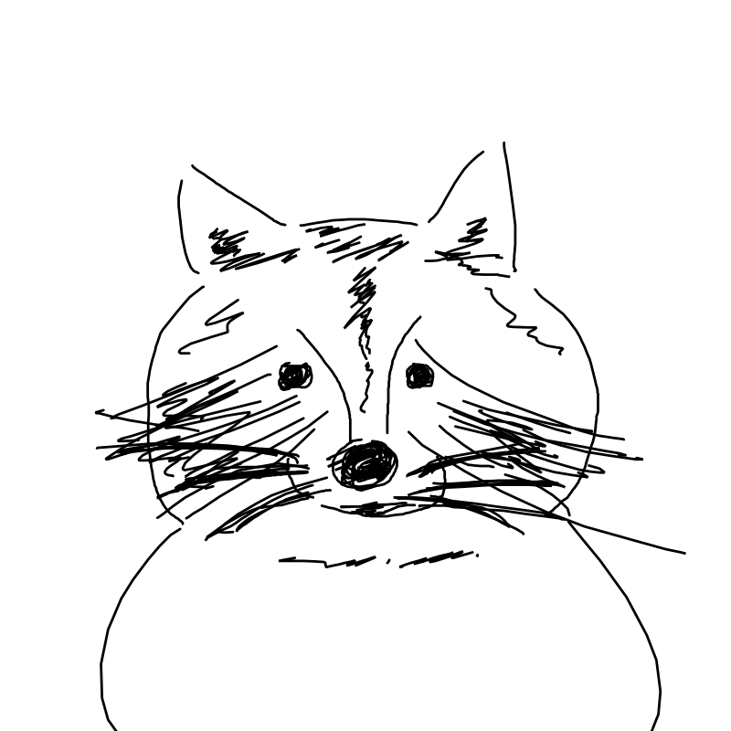

[DEMO](https://godicheol.github.io/canvaaas/)

1. HTML

```html
<style>
  #target{
    margin: 24px; /* overlay size */
    overflow: hidden; /* recommend */
  }
</style>
```

```html
<!-- MAIN ELEMENT -->
<div id="target"></div>
```
2. Init

```html
<script>
  canvaaas.init( document.getElementById("target") , function(err, res){
    if (err) {
      console.log(err);
      return false;
    }
    console.log("canvaaas.init() callback", res);
  });
</script>
```
3. Set Config (optional)

```html
<script>
  canvaaas.config({
    allowedExtensions: [
      "jpg",
      "jpeg",
      "png",
      "gif",
      "svg",
      "svg+xml",
      "tiff",
      "tif",
      "webp"
    ], // array
    cacheLevels: 999, // number
    containerAspectRatio: 1 / 1, // number, width / height
    maxContainerWidth: 1, // number, 0 ~ 1, scale in viewport(device screen)
    maxContainerHeight: 0.7, // number, 0 ~ 1, scale in viewport(device screen)
    renderScale: 0.5, // number, 0 ~ 1, scale in canvas
    restrictAfterRender: false, // boolean
    restrictMove: false, // boolean
    restrictRotate: true, // boolean
    restrictResize: true, // boolean
    restrictFlip: false, // boolean
    restrictRotateAngleUnit: 45, // number, 1 ~ 360
    restrictFlipAngleUnit: 180, // number, 1 ~ 180
    canvas: function(err, res){
      if (err) {
        console.log(err);
        return false;
      }
      console.log("config.canvas callback", res);
    },
    upload: function(err, res){
      if (err) {
        console.log(err);
        return false;
      }
      console.log("config.upload callback", res);
    },
    focus: function(err, res){
      if (err) {
        console.log(err);
        return false;
      }
        console.log("config.focus callback", res);
    },
    edit: function(err, res){
      if (err) {
        console.log(err);
        return false;
      }
      console.log("config.edit callback", res);
    },
    remove: function(err, res){
      if (err) {
        console.log(err);
        return false;
      }
      console.log("config.remove callback", res);
    },
  });
</script>
```

4. New Canvas (optional)

```html
<script>
  canvaaas.new({
    filename: "TEST",
    width: 1800, // number, px
    height: 1200, // number, px
    overlay: true,
    checker: true,
    editabled: true,
    focusabled: true,
    drawabled: true,
    background: "#000000" // rgb format or "alpha"
  }, function(err, res){
    if (err) {
      console.log(err);
      return false;
    }
    console.log("canvaaas.new() callback", res);
  });
</script>
```

5. Open Image

```html
<input id="blahblah" type="file" onchange="canvaaas.uploadFile(this.files)" accept="image/*">
```

```html
<script>
  canvaaas.uploadUrl( Your URL, function(err, res){
    if (err) {
      console.log(err);
      return false;
    }
    console.log("canvaaas.uploadUrl() callback", res);
  });
</script>
```

```html
<script>
  canvaaas.uploadState( Your JSON or JSON.stringify(Your JSON), function(err, res){
    if (err) {
      console.log(err);
      return false;
    }
    console.log("canvaaas.uploadState() callback", res);
  });
</script>
```

```html



<script>
  canvaaas.uploadElement( document.getElementById("blahblah") , function(err, res){
    if (err) {
      console.log(err);
      return false;
    }
    console.log("canvaaas.uploadElement() callback", res);
  });
</script>
```

6. Save File

```html
<script>
  canvaaas.draw({
    filename: 'thumbnail_256x256px', // optional, default "untitled"
    dataType: 'url',  // optional, "url" or "file", default "url"
    mimeType: 'image/png', // optional, default "image/png"
    drawWidth: 256, // optional, default canvasWidth
    drawHeight: 256, // optional, default canvasHeight
    quality: 0.5, // optional, default 0.92
    background: '#000000', // optional, rgb format, default "#FFFFFF"
  }, function(err, res, result){
    if (err) {
      console.log(err);
      return false;
    }
    console.log("canvaaas.draw() callback", res, result);
  });
</script>
```

7. Save File from JSON Data

```html
<script>
  canvaaas.drawTo({
    // getCanvas()
    filename: 'drawTo_3600x3600px', // optional, default "untitled"
    dataType: 'url', // optional, default "url"
    mimeType: 'image/png', // optional, default "image/png"
    width: 1800, // required, px
    height: 1200, // required, px
    drawWidth: 3600, // optional, default width
    drawHeight: 3600, // optional, default height
    quality: 0.92, // optional, default 0.92
    background: '#FFFFFF', // optional, rgb format, default "#FFFFFF"
  }, {
    // getImages()
    "src": "./img/1.png", // required
    "index": 1, // required
    "width": 600.0000000000001, // required
    "height": 600.0000000000001, // required
    "x": 399.07235621521335, // required
    "y": 808.7198515769946, // required
    "rotate": 17.46323891797897, // required
    "scaleX": 1, // required
    "scaleY": 1, // required
    "opacity": 1, // required
    "drawabled": true, // required
  }, function(err, res, result){
    if (err) {
      console.log(err);
      return false;
    }
    console.log("canvaaas.drawTo() callback", res, result);
  });
</script>
```
